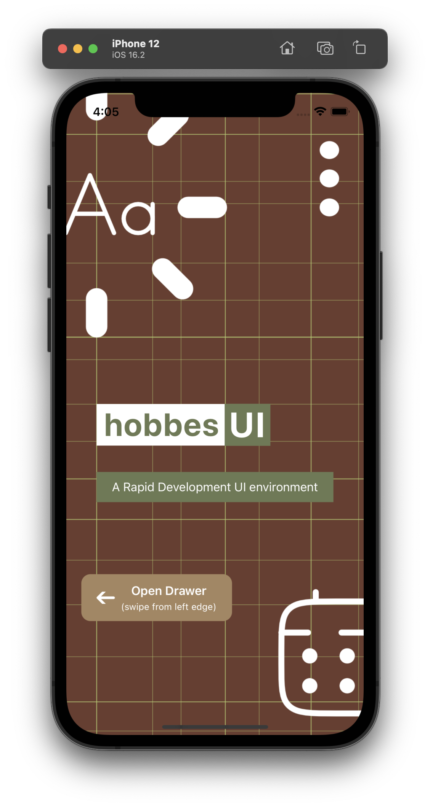
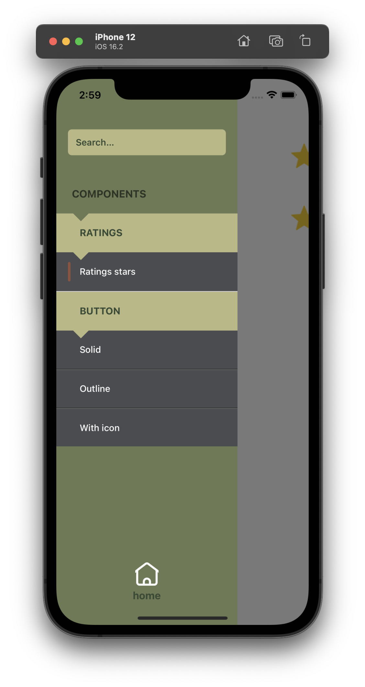
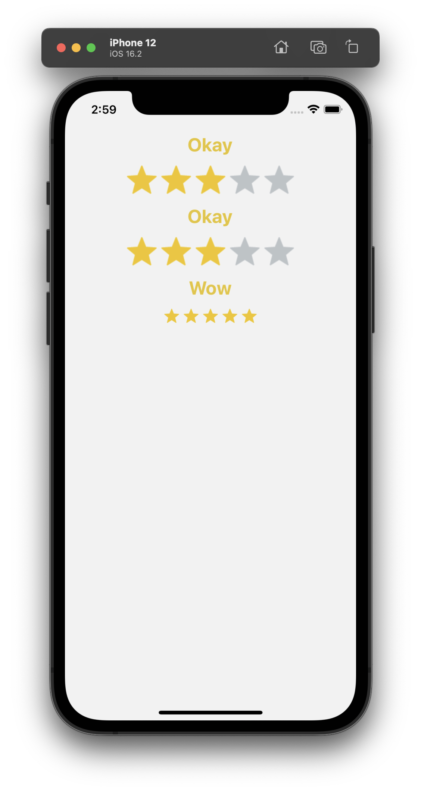

# HobbesUI
### _a rapid development environment for UI components_

<div style="display: flex;">
  
  
  
</div>

Think of Storybook but simplified and thought for ReactNative from scratch.

React Native development world, even related with reactjs, has important differences, one of those the UI Components velocity development.

## Requirements
```
- react 18.2.0
- react-native ^0.72.0
- @react-navigation/native ^6.1.9
- @react-navigation/drawer ^6.6.6
- react-native-gesture-handler ^2.14.0
- react-native-reanimated ^3.6.1
- react-native-screens ^3.29.0
```

If you're using react-navigation in your app you can ignore these steps, otherwise you can install it as a `dev dependency` (if you don't want it or need it).

Here are the main steps to keep in mind when installing the required libraries, specifically [react-navigation](https://reactnavigation.org/docs/getting-started) 

_note: you can and should check the oficial documentation, here you'll find the essential steps_

### drawer
Add the following import to the top file of the app (i.e. index or App)

```
import 'react-native-gesture-handler';
```

### react-native-reanimated
Add the following to your `babel.config.js`

```
module.exports = {
  ...
  plugins: [
    "react-native-reanimated/plugin",
    ...
  ],
  ...
};
```

### Android

- `MainActivity` class file

```
// JAVA
public class MainActivity extends ReactActivity {
  // ...
  @Override
  protected void onCreate(Bundle savedInstanceState) {
    super.onCreate(null);
  }
  // ...
}
```

```
// KOTLIN
class MainActivity: ReactActivity() {
  // ...
  override fun onCreate(savedInstanceState: Bundle?) {
    super.onCreate(null)
  }
  // ...
}
```

Add next import to the top file of `MainActivity` class below your package statement

```
import android.os.Bundle;
```

### iOS
```
$> cd ./ios
$> npx pod-install ios
```

## Install
```
yarn install hobbesui --dev
```

## Configuration
Because mobile environment is different from web, we can’t think of a solution like this in terms like storybook or styleguidist - or any similar tool - do. 

So there’s a little manual configuration you need to set up, which also gives the freedom to decide under which circumstances you want to include *hobbesui* i.e. only development, also for staging, a different build for the designer, etc.

Add `hobbesStories.(js|ts)` file to the root of your project, into this file you need to import every file you create to render the components previews, i.e.

_note: in previous version the name of the file was `styleguidesToLoad` it has been changed to keep naming consistency_

```
import 'components/MyComponent/myComponent.hobbes';
import 'components/MyOtherComponent/myOtherComponent.hobbes';
import 'screens/Login/Login.hobbes';
```

_`*.hobbes.js` extension is just a suggestion to differentiate your source code files from your `hobbesui` files, you could use any convention but be consistent_

You need to set your app to render *hobbesui*:

```
import { Hobbes } from 'hobbesui';

...

function App(props) {
  ...
  const hobbes = (
    <Hobbes.UI />
  );

  ...
}
```

### Props ([TS defs](https://github.com/diablourbano/hobbesui/blob/release/src/interfaces.ts))
```
export type WelcomeProps = {
  appDescription?: string;
  styles?: {
    container?: Styles;
    isoContainer?: Styles;
    isoText?: Styles;
    isoDesc?: Styles;
    button?: Styles;
    buttonText?: Styles;
  };
};

export interface IUIprops {
  welcome?: WelcomeProps;
  onLeaveHobbes?: () => void;
}
```

and set it on any part of your app route you consider relevant and configure your app to be able to access it.

_note: you can use [DevSettings](https://reactnative.dev/docs/devsettings) to include it in the `dev menu`_

## Use it
*hobbesui* follows the` Lego concept` idea - there’re several ways to call it - and renders a View with your screen or component plus a nagivation drawer which allows you to categorize your components, i.e. components 
(buttons, labels, colors, etc) scenes (think of the presentational side of an screen).

`./sampleComp.hobbes.tsx`
```
import React from 'react';
import { stories } from 'hobbesui/src/functional';
import MyComponent from './myComponent';

stories.add({
  id: 'DEFAULT_STATE',
  parent: 'FOO', // optional, default = 'parent'
  group: 'BAR', // optional, default = 'group'
  title: 'my component default state',
  component: (props => (
    <MyComponent
      {...props /* in case you want to access navigation props */}
      someProp="someProp"
    />
  ),
  props: {name: value}, // optional
});
```

Because *hobbesui* uses react-navigation for its components rendering, you can also implement workflows between your scenes if you pass 
them `navigation` props, this can accelerate and improve the app workflow/navigation between screens

```
...
const navigateTo: () => navigate(SCREEN_ID)
...
```
_note: this is the id property when you add the component story_

**It can also be a helpful environment to implement a prototype**

## Use cases
Here are some ideas of what can be implemented to improve your UI development and the communication with the team, including the designer.

- Group of `unit components` e.g. button, input, divider
- Group of `screens` e.g. Login, Activities
- Group of `resources` e.g. FontFamilies, Icon sets
- Group of `animations`
